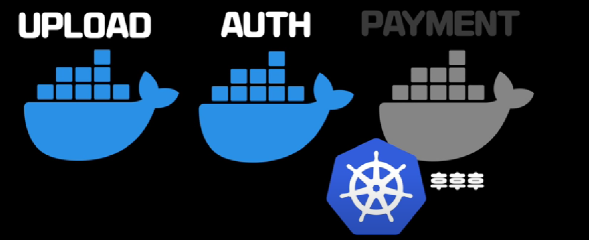

# Kubernetes

**개요**
* 자동 배포화툴 젠킨스를 통해 여러 컨테이너들을 다루는데 빌드, 배포에 필요한 모든 명령어들을 각 컨테이너마다 모두 작성해주었음
* 배포될 서버가 추가된다면? 해당 서버에 맞는 스크립트 추가 필요
* 배포 방식이 바뀐다면? 배포 스크립트를 찾아서 수정할 필요가 있음.
* 이처럼 인프라 관리의 편리함으로 도커를 도입했지만 컨테이너가 점점 많아지면서 결국 관리는 어려워지기에 이를 해결하기위함이 오케트스테링션 툴 중에 하나인 쿠버네티스임.

## Kubernetes 필요성

### 쿠버네티스 활용예제1
* 도커를 이용해서 웹사이트를 배포하는 경우 도커 컨테이너 안에 넣어서 AWS로 보내는 경우
* 이 프로세스에서는 쿠버네티스를 알아야할 이유가 없음.
* 도커를 업로드하고 배포하는 것이 전부이기때문임.

* 하지만 이와 같은 상황에서 PAYMENT 에 도커에 있는 컨테이너의 서버가 장애가 발생한 경우 쿠버네티스가 이를 재시작해주는 역할을 함.
* 즉, 컨테이너들의 모니터링을 실시함.
* 이 처럼 컨테이너가 많은 경우 쿠버네티스가 유용함.

### 쿠버네티스 활용예제2
* 1만명의 유저가 접속을 할 경우, 자동으로 새로운 컨테니어들을 만들 수 있음.
* 사람들이 떠나고 니즈가 줄어들면, 컨테이너를 지정해둔 최소 숫자로 자동으로 조정해줌.
* 즉, 수동으로 해야할 것을 자동으로 도와줌.

### 쿠버네티스 활용예제3
* 클라우드에 5개의 컨테이너가 있는 경우, 그 중 하나의 업데이트를 하는 경우
* 컨테이너들을 끄고 새로운 버전을 올리고 다시 컨테이너들을 켜야함.
* 쿠버네티스는 이를 신규 버전 차례로 업데이트해줌.
* 즉, 새로운 버전 배포 및 자동화 서비스를 제공해줌.