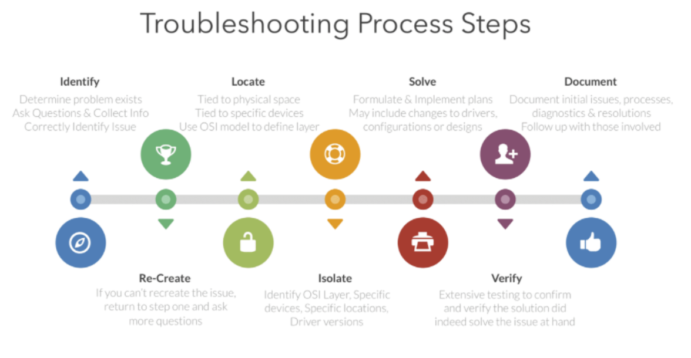

# Troubleshooting

## 개요 
* 면접관 : 트러블 슈팅에 대한 경험이 있는지?? 
* ? : ...?

* 트러블슈팅에 대한 개념, 경험이 없어 개념에 대해 정리하고자함.

## 트러블슈팅

> 문제가 발생했을때 원인을 규명하고 해결하는 작업을 의미함.

* 즉, 한마디로 정의하자면 **시스템에서 발생하는 문제들을 종합적으로 진단하고 해결해나가는 과정**.

## 트러블슈팅 단계

* 문제를 해결해나가는 과정에서 여러 단계를 통해 문제가 발생하게 된 원인을 규명하고 진단하는 것.
* 이 문제의 원인이 될 수 있는 것들을 가능성이 높은순으로 하나씩 제거하는 방법.
* 기본적인 순서는 아래와 같음.

1. 문제 정의
    * 문제가 되는 동작 혹은 원인 확인
2. 사실 수집
    * 해당 문제에 대한 정보 수집
    * 문제를 재현하는 방법 수집
3. 원인추론
    * 확인된 사실을 통해 원인 추론
4. 조사방법 결정
    * 증상과 추론 원인을 기반으로 어떤 순서로 문제를 해결할지 결정
    * 보통 가능성이 높은 원인을 우선적으로 조사
5. 조사 방법 구현
    * 앞서 결정한 내용을 토대로 문제를 조사
6. 결과 관찰
    * 조사 방법을 구현하고 그 결과를 기록
    * 만약 문제가 해결되지 않았다면 4번으로 돌아감
7. 문서 작성
    * 문제를 해결한 순서를 정리해 문서화함

## 트러블슈팅 예제

